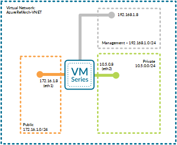

# Deploy a VM-Series firewall into an existing Azure Resource Group

This template deploys a (3) interface Palo Alto Networks VM-Series firewall as shown below:

  

This template was created to support the deployment of a 3 interface Palo Alto Networks firewall into an existing Microsoft Azure environment that has the following items already deployed:

                    - VNET (assumes "AzureRefArch-VNET" is already created with following subnets):
                      - Management (10.0.0.0/24)
                      - Untrust (10.0.1.0/24)
                      - Trust (10.0.2.0/24)

                    
            
FEATURES:
- The firewall deploys with (3) interfaces
  - (1) management interface 
  - (2) dataplane interfaces
  
- You may choose the version of software the firewall is running (7.1.1, 8.0.0, 8.1.0 or latest).
- You may choose the deployment SKU for the firewall: (byol, bundle1 or bundle2).
- Static IP address assignment is used for all the firewall interfaces.

                   
The following VMs are supported:

                    -Standard_D3
                    -Standard_D4
                    -Standard_D3_v2 (used in deployment guide)
                    -Standard_D4_v2
                    -Standard_A4
                    -Standard_DS3_v2
                    -Standard_DS4_v2
        
NOTE: Make sure the VMs are supported in the specific Storage Account Type and Azure Region.

After deployment, this firewall can be integrated into Azure load balancer backend pools using the Azure Resource Manager Portal.
